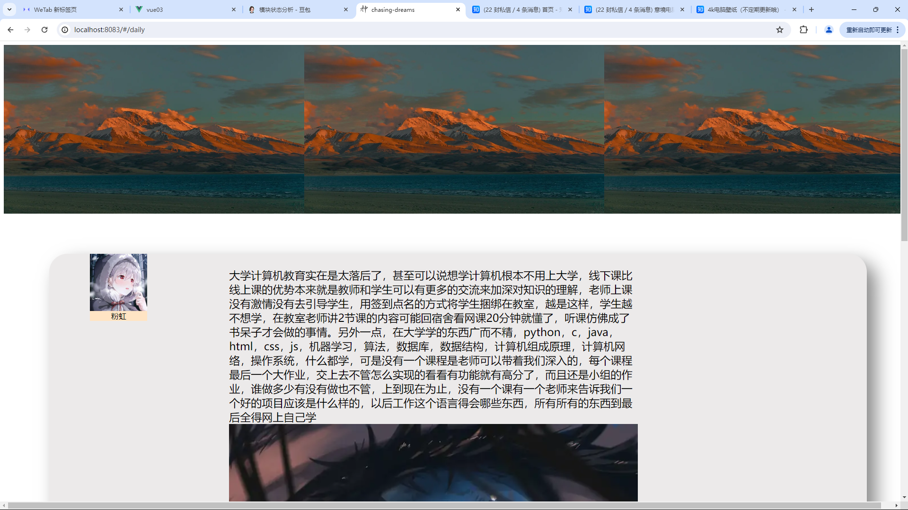
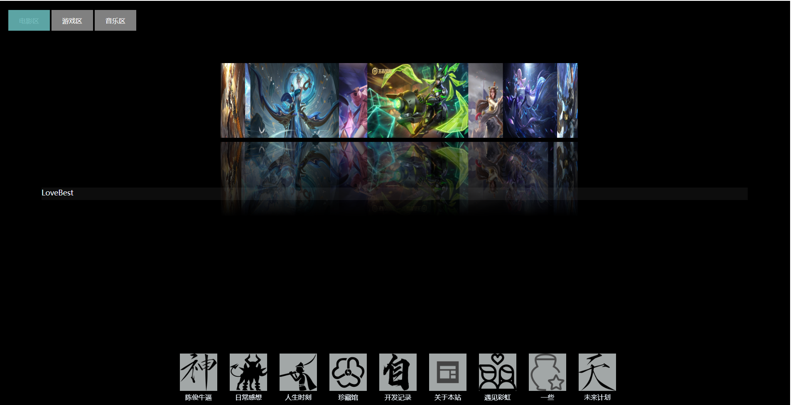
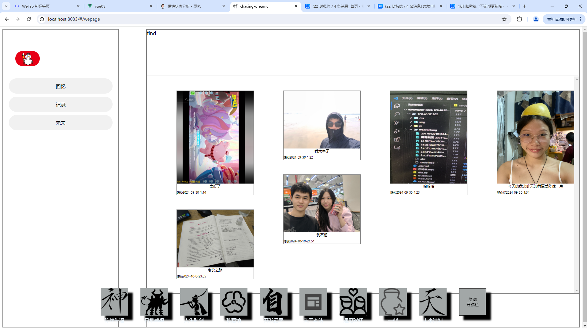
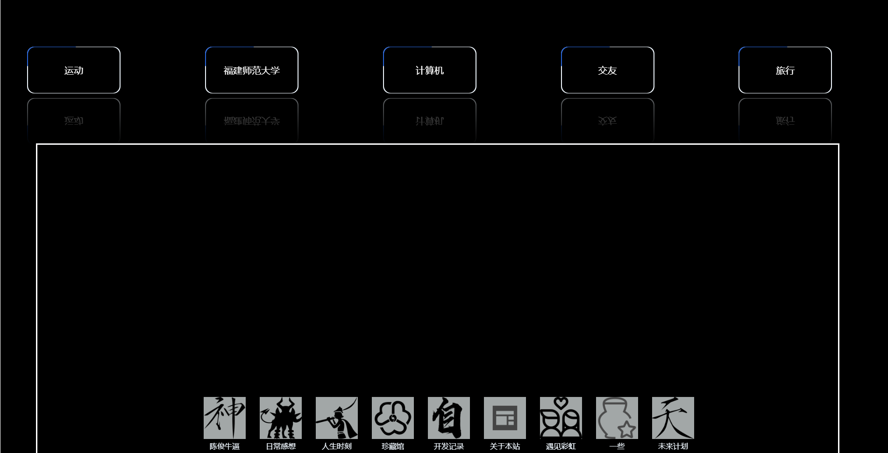

# 0.1.0版本
## 一. 导航栏

有了全局的导航栏
## 二. 收藏馆界面

1. 为收藏馆界面添加了路由，可以从首页点击docker中收藏馆图标进入收藏馆界面
2. 新增了一个旋转照片墙组件，照片可以旋转来展示，但是照片倒影的效果只能支持webkit内核的浏览器
3. 添加了一个照片展示的组件，用于展示电影，游戏，音乐等，可以使用插槽来进行多场景复用
   
4. 音乐界面 
   1. 第一套方案是将音乐，歌词，封面上传到服务器，同时记录下音乐的存储位置，等要用的时候再向服务器数据库发请求
      通过数据库的存储位置，将音乐，歌词，封面拿到界面中进行播放，技术上是可行的，但是实际操作过程中太费时，向
      数据库发请求，数据库查询，获取服务器上的音乐，将获取到的buffer文件转为可被audio使用的.MP3文件都要时间，
      点进去加载需要几十秒，所以还是放弃了第一个方案
   2. 第二套方案是将音乐歌词等文件直接存在服务器上的固定文件夹里，在数据库只要存他们的名字，在将服务器用nginx那
      些配一下就可以直接用url来使用服务器的资源了这样的话会快很多
   3. 总体的界面设计是仿造网易云音乐的，目前只有播放暂停的功能，在未来的开发中，我想要把切歌，评论，随机播放，查
      找音乐那些功能都实现
## 三. 陈俊牛逼界面

1. 做这个界面的初衷是为了展示我的一些兴趣爱好还有一些经历之类的，希望大家可以从这个界面了解到我是一个什么样的人
2. 目前分为了五个板块：运动，旅行，福建师范大学，计算机，交友，其中运动板块可以介绍一些我喜欢运动，旅行板块来展示我去过的地方吃过的美食，福建师范大学板块来介绍我的学校，计算机板块来介绍我的一些计算机方面的经历，交友板块来展示我的社交账号，让大家能够添加我好友
   