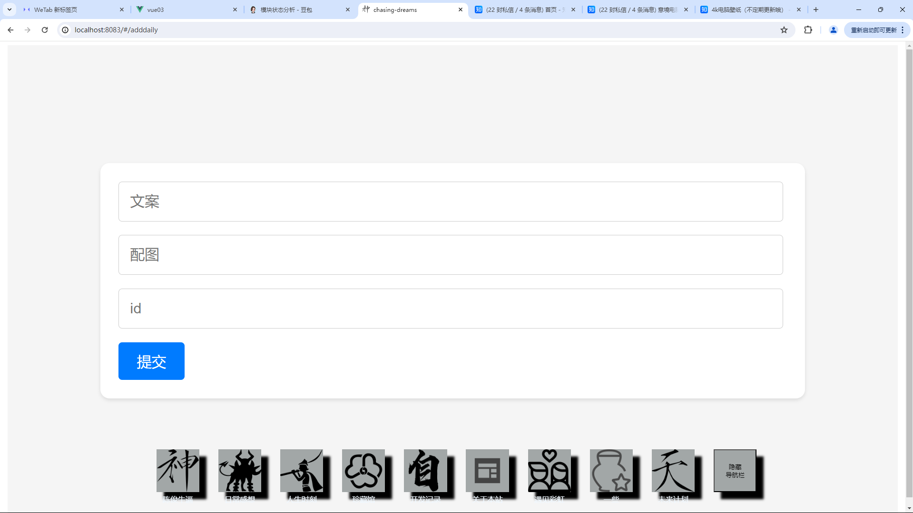
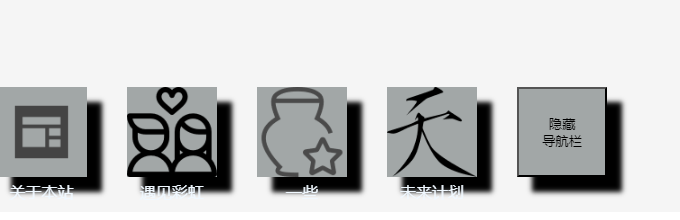
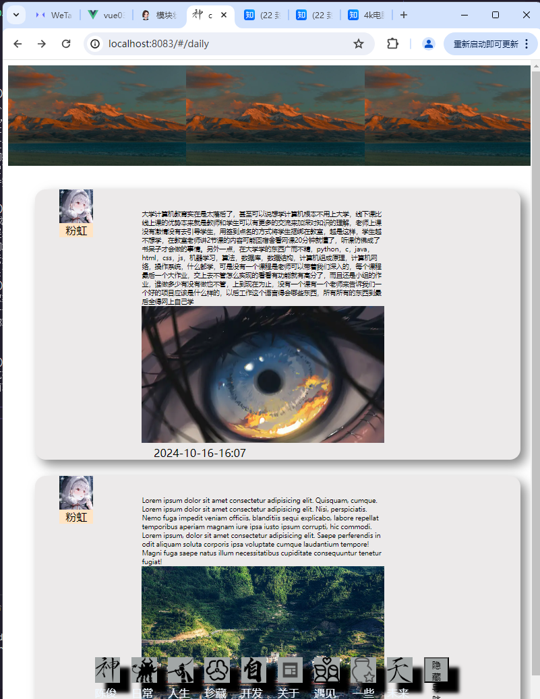

# 0.2.0版本
开始日期：2024.9.22
## 一·wepage模块
为了我和小虹互相记录恋爱中的点点滴滴设计了这个模块，目标是实现小红书网页版的大部分功能
目前实现了wepage首页，事件浏览，事件记录三个模块
#### wepage首页

背景用了瀑布流布局（虽然我不知道是不是正宗的，就是分类四列，每列宽度一样，然后每个照片的宽度固定，高度自动，好像也就像那么回事了
然后有一个登录的组件是半透明的，鼠标悬停的时候会将透明度设置为1，但是目前还没有用户管理的功能，未来会有登录验证的功能
#### eventcount模块

用于查看我们记录的一些事件，同样使用了“瀑布流布局”，但是效果好像还没那么好，界面还比较简陋未来还有很多需要优化的地方
#### addevent模块

一个简单的收集信息上传信息的界面。但是可圈可点的是在这个模块首次实现了将图片上传到服务器，然后将图片的url存储到数据库中，我自己的服务器初步有了存储媒体文件的功能，也算是一个里程碑的突破了。记得当时遇见一个很头疼的问题，中文的文件名上传到服务器总是会出现乱码的问题，我后来想到的办法是在客户端发请求之前将文件名用encodeURIComponent(file.name)的方式先编码在服务器端处理请求的时候再解码，但是当时真的搞了好久，我一直纠结于给文件名直接用这个编码但是不知道为什么它提示file.name是不能修改的，搜了n中方式都没能解决，最后用了我最开始以为很麻烦但是实际上很简单的方法：发请求的时候多带一个参数：编码后的文件名，然后服务器段把这个参数设置为文件名就好了。
## 二.日常感想界面

这个有点借鉴qq空间，但是我是想做一个比较有逼格的界面来展示我的一些深刻的想法，因为我做这个网页的初衷是为了展示我自己，展示我的兴趣爱好，经历，技能之类的，说白了就是装逼，一个装逼的网站，怎么能没有一个部分来展示我的深刻的内心世界呢。但是原理也很简单，没有复杂的地方所以几个小时也就差不多了（还是因为我写代码老是这里不小心写错那里不小心写错的），在后期我想再把这个界面做的更加精致一点，既然后端的技术都很简单，那我就把前端的技术多发挥一点吧。

因为是我自己用的这个信息收集界面就做的非常简陋了，三个输入框一个提交按钮，甚至还是让ai写的样式，但是从这里暴露了我的一个问题，写代码的时候我一直没有积攒出自己的经验，一个跟简单的布局每次都还要想很久，代码写的也都不是最简单的方法，以后写代码的时候应该多思考，尽量去用最简单搞笑的方法，多总结，多积累。
## 三.隐藏导航栏

最右边多了一个方块隐藏导航栏，因为有时候这个导航栏会非常影响观看体验，所以搞了这个功能，怎么让他再弹出来还需要研究，目前就是刷新一下界面它就回来了。
## 四.屏幕适应性

原来的界面元素的大小全是用px写死的，这就导致了在不同的屏幕上显示的效果不一样，所以我就用了vw来写，这样的话就可以让界面元素的大小随着屏幕的大小而变化，但是这样也有弊端，实在想不出一个很完美的方法，目前的结果我已经算比较满意了，起码在手机和电脑上来看都还算赏心悦目。

完成时期：2024.10.16